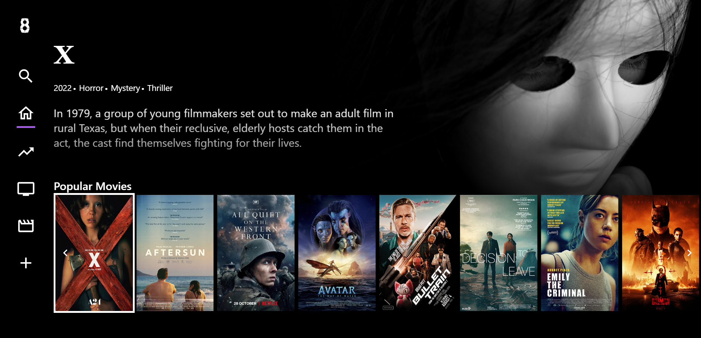

# 8Video

8Video is an imitation at a movie streaming service, made with Vue.js, Tailwind CSS and Pinia.

## Installation

Download the source files from the download button.

## Usage

To run the program go into its folder, open the cmd inside
and type:
```cmd
npm run dev
```
When started it will give you a local link to acess the program.

  
